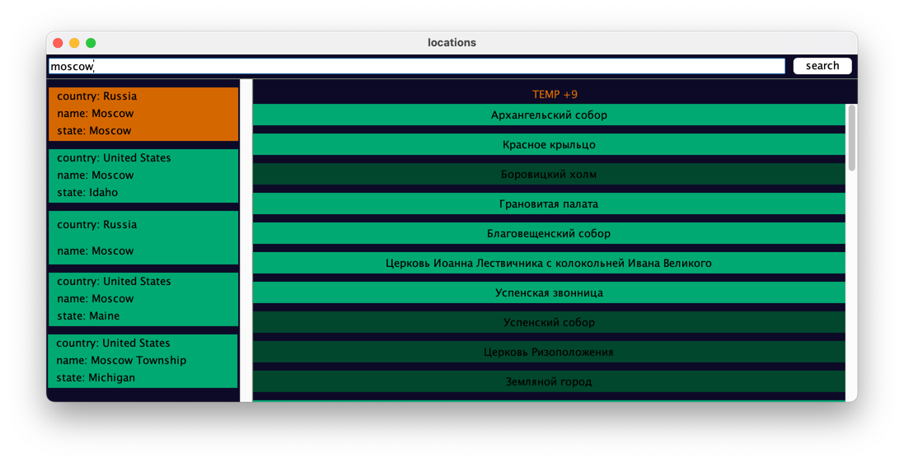

# Lab3

# Поиск интересных мест

Программа Использует различные api сервисы для поиска по координатам и названию. 
Независимые запросы осуществляются асинхронно. Реализация строится на архитектуре MVC, java swing,
Completable future для выполнения асинхронных запросов

# Вид приложения

Слева отображаются локации, по центру - интересные места и погода, подсвеченные места также имеют описание

# Сборка 

Программа использует систему сборки maven. Для сборки jar файла написать команду mvn package находясь в корневом каталоге программы.
